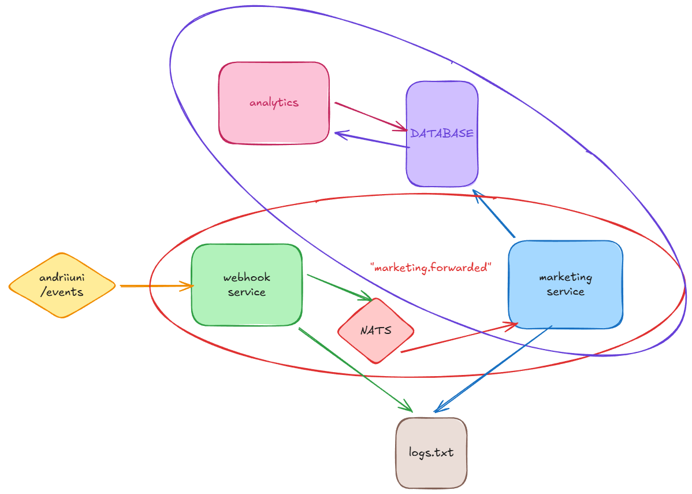
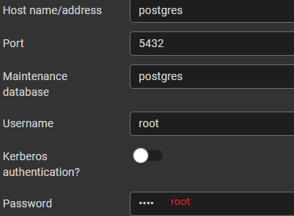

[](https://github.com/bydyas/webhook/actions/workflows/webhook.yml)

# Test Task — Backend Engineer

* [Useful links](#useful-links)
* [Structure](#structure)
* [How to run](#how-to-run)
* [Swagger](#swagger)
* [Database](#monitor-db)
* [NATS](#nats-stats)

## Structure


Monorepo (Turborepo) has some microservices: **gateway**, **marketing**, **analytics** (in progress) - and some custom shared libs, such as **@common/contacts**, **@common/health**, **@common/logger**, and jest&eslint&prettier configs.

## How to run
Start the application with all dependencies
```
docker-compose up
```

## Swagger
**gateway** & **analytics** services have ==[Swagger](http://localhost:300/api)== to trigger endpoints _ad-hoc_.

## Monitor DB

Log into [pgAdmin](http://localhost:8080/browser/)
```
username: root@root.com
pwd: root
```

Connect to DB:



Query the events table
```
SELECT * FROM events
```

## NATS Stats
Go to [NATS dashboard](http://localhost:8222/varz)


## Pitfalls

Search for ```TODO:``` in code for more deatails:

1. NATS Cores should be replaced with NATS JetStream
2. Bulk insert to DB
3. Better to use Grafana instead saving logs locally (Winston)
4. Migrations are needed for prod

## Useful links

1. [Task Notion](https://opaque-production-68e.notion.site/Test-Task-Backend-Engineer-Node-js-NATS-29dce9899cb7804d9934d22be768a486)
2. [Trello Dashboard](https://trello.com/b/iSyTRhiX/test-task-backend-engineer-nodejs-nats)